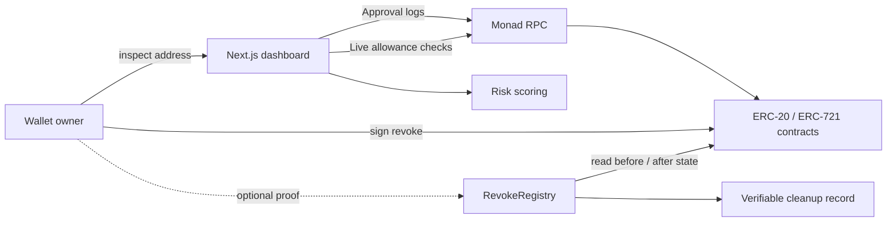

# Allowance Revoker

[](https://github.com/Ashfaaq98/allowance-revoker/actions/workflows/ci.yml)
[](LICENSE)
[](https://nextjs.org/)
[](https://www.typescriptlang.org/)
[](https://soliditylang.org/)
[](https://getfoundry.sh/)

A Monad wallet-security tool for discovering active ERC-20 allowances and ERC-721 collection approvals, assessing their exposure, and revoking them. The interface reads live chain state directly; it has no backend or seeded data.

> **Project status:** Source-only. No public web deployment or `RevokeRegistry` mainnet deployment is currently associated with this repository.

## Features

- Scans ERC-20 `Approval` and ERC-721 `ApprovalForAll` history.
- Re-validates every candidate against current on-chain state to discard spent, revoked, and spam approvals.
- Shows an inspectable, additive risk score rather than opaque security labels.
- Revokes ERC-20 allowances and ERC-721 collection approvals from the owner’s wallet.
- Optionally records a two-phase, on-chain proof that an approval existed and was revoked.

## How the proof works

`RevokeRegistry` does not custody funds or perform the revoke. It brackets the owner’s normal revoke transaction:

1. `arm` snapshots a non-zero live approval.
2. The wallet revokes the approval directly on the token contract.
3. `confirm` verifies the approval is now zero and records the cleanup.

This avoids falsely crediting pairs that were never approved, since zero is the default allowance.

## Design



## Scope and limitations

- Supports ERC-20 allowances and ERC-721 `setApprovalForAll` collection approvals.
- Does not support individual ERC-721 approvals, ERC-1155 approvals, or Permit2 internal allowances.
- High-activity wallets can receive partial historical coverage; the UI reports the oldest block reached.
- The known-spender list is intentionally small, so “unrecognised” does not mean malicious.
- This project has not received an external security audit. Risk scores are guidance, not a safety guarantee.

## Local development

Prerequisites: Node.js 20+ and [Foundry](https://getfoundry.sh) for contract work.

```bash
git clone --recurse-submodules https://github.com/Ashfaaq98/allowance-revoker.git
cd allowance-revoker/web
npm ci
cp .env.example .env.local # optional; enables proof logging when a registry address is available
npm run dev
```

Open `http://localhost:3000` and paste an address to use the read-only inspector. A wallet is required only to revoke that wallet’s approvals.

## Testing

```bash
# Web
cd web
npm run lint
npm test
npm run build

# Contracts
cd ../contracts
forge test -vv
```

The local end-to-end harness starts Anvil, deploys the registry and a mock token, and configures the web app for the full revoke flow:

```bash
./scripts/local-e2e.sh
```

## Project structure

```text
contracts/  Solidity registry, deployment script, and Foundry tests
web/        Next.js dashboard, scanner, risk model, and wallet flow
scripts/    Local end-to-end harness
```

## Security

Please follow [SECURITY.md](SECURITY.md) for responsible disclosure guidance.

## License

[MIT](LICENSE)
